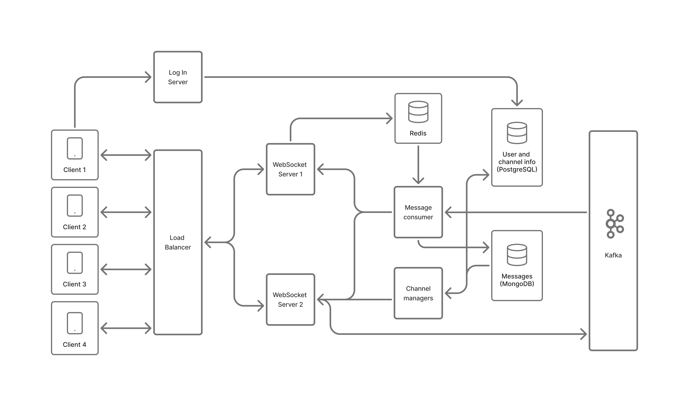

# Realtime Chat built with Kafka

## A scalable, microservices-based chat platform powered by Apache Kafka

A modern, event-driven chat application that demonstrates microservices architecture and real-time communication using Apache Kafka, FastAPI, WebSockets, and multiple databases (PostgreSQL, MongoDB, Redis). The platform supports multiple clients including a web interface and a SwiftUI app.

<details>
<summary>Table of Contents</summary>

- [Key Features](#key-features)
- [Architecture](#architecture)
  - [Communication Patterns](#communication-patterns)
- [Technology Stack](#technology-stack)
- [Installation](#installation)
- [Project Structure](#project-structure)
- [Development Progress](#development-progress)
- [Future Enhancements](#future-enhancements)
- [Learning Resources](#learning-resources)
- [Feedback](#feedback)
- [Project Background](#project-background)

</details>



## Key Features

- **Real-time messaging** via WebSockets with efficient message delivery
- **Scalable microservices architecture** with load balancing
- **Event-driven communication** using Apache Kafka for message distribution
- **RESTful API services** for authentication and inter-service communication
- **Multiple database solutions**:
  - PostgreSQL for user and channel data
  - MongoDB for message storage and history
  - Redis for real-time connection tracking
- **JWT-based authentication** with RSA key encryption
- **Multi-client support** (Web and iOS/SwiftUI)
- **Channel management** (create, join, search)
- **Message history** with proper timestamps and date formatting

## Architecture

The project is built using a microservices architecture with the following components:

- **Login Server**: Handles user authentication and JWT token generation via REST API
- **WebSocket Server**: Manages real-time client connections with load balancing
- **Message Consumer**: Processes messages from Kafka and routes them to appropriate recipients
- **Channel Manager**: Handles channel operations (create, join, search, history) through REST endpoints
- **Web Client**: Browser-based client interface
- **SwiftUI Client**: Native iOS client (in development)
- **Nginx**: Load balancer for WebSocket connections

### Communication Patterns

The system uses multiple communication patterns:
- **REST APIs** for:
  - User authentication and registration
  - Channel management (create, join, search)
  - Service-to-service communication
  - Message history retrieval
- **WebSockets** for:
  - Real-time bidirectional communication with clients
  - Live message delivery
- **Kafka** for:
  - Asynchronous message processing
  - Message distribution to multiple consumers

## Technology Stack

- **Backend**: FastAPI (Python)
- **APIs**: RESTful endpoints with JSON
- **Message Broker**: Apache Kafka
- **Databases**:
  - PostgreSQL (relational data)
  - MongoDB (message storage)
  - Redis (connection state)
- **Frontend**: HTML/CSS/JavaScript, Bootstrap
- **Mobile**: SwiftUI (iOS)
- **Containerization**: Docker & Docker Compose

## Installation

### 1. Start Kafka Infrastructure

```bash
cd fastapi_kafka
docker-compose -f compose.kafka.yaml up -d
```

### 2. Create Kafka Topic

```bash
docker exec -it kafka-cluster-kafka-1-1 /bin/sh

/bin/kafka-topics --bootstrap-server kafka-1:9092 --create --topic messages  --partitions 20 --replication-factor 1

/bin/kafka-topics --bootstrap-server kafka-1:9092 --list
```

### 3. Start the Chat Application Services

```bash
docker-compose up -d
```

### 4. Access the Web Client

Open your browser and navigate to: `http://localhost:5004`

## Project Structure

```
fastapi_kafka/
├── login_server/          # Authentication service
├── websocket_server/      # WebSocket communication service
├── message_consumer/      # Kafka consumer service
├── channel_manager/       # Channel management service
├── web_client/            # Web client interface
├── databases/             # Database initialization scripts
│   ├── mongodb/
│   └── relational_database/
├── nginx/                 # Load balancer configuration
└── auxiliar/              # Utility scripts and keys

RealtimeChat/              # iOS SwiftUI client
```

## Development Progress

- ✅ Backend microservices architecture
- ✅ Kafka message distribution
- ✅ Web client implementation
- ✅ Channel management and message history
- 🔄 iOS SwiftUI client (in progress)
- 🔄 Additional features and optimizations

## Future Enhancements

- Direct messaging between users
- Message read receipts and typing indicators
- Push notifications

## Learning Resources

This project demonstrates several important concepts in software development:

- Microservice architecture design and implementation
- Event-driven systems with Kafka
- Real-time communication with WebSockets
- RESTful API design and implementation
- Database selection for different use cases
- JWT-based authentication based in RSA encryption
- Load balancing and horizontal scaling


## Feedback

Your **feedback** and **suggestions** on this project are highly **appreciated**! If you have ideas for improvements or encounter any bug, **open a new issue** in the GitHub repository with the specific tag

## Project background

This project was created as a personal project after completing the large-scale distributed systems course of my computer science degree in Universitat Pompeu Fabra.

I wanted to deep in my learning of this topics and gain more experience on building this type of systems.

Thank you for taking the time to review this project!
